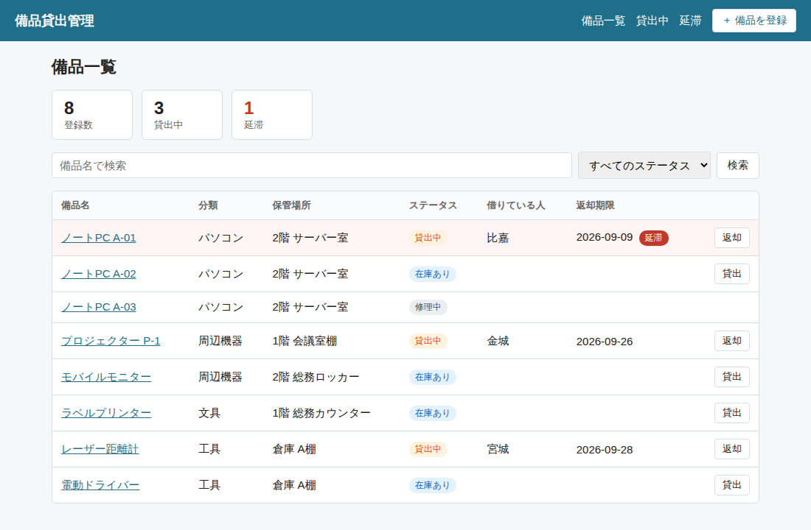
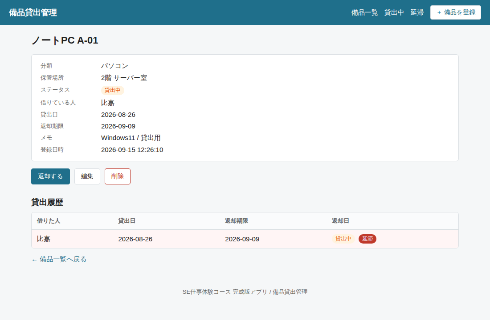

# 備品貸出管理システム（SE仕事体験コース 完成版）

株式会社SOONESS の「SE・システム開発 仕事体験コース」で使う、**完成版のサンプルアプリ**です。

架空の会社「株式会社うるま総合サービス」から、

> ノートPCやプロジェクター、工具などの貸し借りをExcelでやっていて、誰が何を持っているかわからなくなる。Webで管理できるようにしてほしい。

という依頼を受けて作った、という設定の社内システムです。

体験では、このアプリを **参考（お手本）** として手元で動かしながら、自分の体験用アプリを作ったり、顧客からの要件変更に対応したりします。



---

## 目次

1. [できること](#1-できること)
2. [動かし方（Docker）](#2-動かし方docker)
3. [体験用の名前を付けて動かす](#3-体験用の名前を付けて動かす)
4. [Dockerを使わずに動かす](#4-dockerを使わずに動かす)
5. [フォルダ構成と各ファイルの役割](#5-フォルダ構成と各ファイルの役割)
6. [画面とURLの一覧](#6-画面とurlの一覧)
7. [データの構造](#7-データの構造)
8. [設定で変えられること](#8-設定で変えられること)
9. [データを初期状態に戻す](#9-データを初期状態に戻す)
10. [よくあるエラーと対処](#10-よくあるエラーと対処)
11. [使っている技術](#11-使っている技術)
12. [体験の課題](#12-体験の課題)

---

## 1. できること

| 機能 | 内容 |
|---|---|
| 備品一覧 | 登録されている備品を一覧表示。登録数・貸出中・延滞の件数も表示 |
| 検索・絞り込み | 備品名の部分一致検索と、ステータス（在庫あり／貸出中／修理中）での絞り込み |
| 備品の登録・編集・削除 | 備品名・分類・保管場所・ステータス・メモを管理。備品名は必須・50文字以内 |
| 貸出 | 借りる人・貸出日・返却期限を入力して貸し出す。返却期限は貸出日の14日後が自動で入る |
| 返却 | ワンクリックで返却。備品のステータスが「在庫あり」に戻る |
| 延滞の表示 | 返却期限を過ぎた貸出は赤く表示。延滞だけの一覧もある |
| 貸出履歴 | 備品ごとに、過去に誰がいつ借りて、いつ返したかを一覧表示 |
| サンプルデータ | 初回起動時に備品8件と貸出記録（延滞1件を含む）が自動で入る |

「ログイン」「複数拠点」「消耗品（数量管理）」「メール通知」などは、あえて入れていません。これらは体験の課題（要件変更）として登場します。

---

## 2. 動かし方（Docker）

### 必要なもの

- **Docker Desktop**（Windows / Mac）：インストールして**起動しておく**（画面上部のメニューバー／タスクバーにクジラのアイコンが出ていればOK）
- **Git**：ダウンロードに使います（なければ下の「方法B：zipでダウンロード」でもOK）

### 最短手順（慣れている人向け）

```bash
git clone https://github.com/DevSOONESSorg/bihin-app.git
cd bihin-app
docker compose up
```

起動したら、ブラウザで <http://localhost:3000> を開きます。

---

### 手順（くわしく）

#### ① ターミナルを開く

| OS | 開き方 |
|---|---|
| Windows | スタートメニューで「PowerShell」と入力して開く |
| Mac | `Command + Space` で Spotlight を開き、「ターミナル」と入力して開く |

#### ② 置き場所のフォルダに移動する

どこに置いてもかまいませんが、迷ったら「デスクトップ」にしましょう。

```bash
cd ~/Desktop
```

> Windows で OneDrive を使っている場合は、デスクトップが `~/OneDrive/Desktop` にあることがあります。うまく移動できないときはこちらを試してください。

#### ③ アプリをダウンロードする

**方法A：git clone（おすすめ）**

1. このリンクをコピーします

   ```
   https://github.com/DevSOONESSorg/bihin-app.git
   ```

2. ターミナルに `git clone ` と入力します（**clone のあとに半角スペース**を1つ入れる）
3. 続けて、コピーしたリンクを貼り付けます
   - Windows（PowerShell）：`Ctrl + V` または **右クリック**
   - Mac：`Command + V`
4. 次のようになっていれば、`Enter` を押します

   ```bash
   git clone https://github.com/DevSOONESSorg/bihin-app.git
   ```

5. `bihin-app` というフォルダができればダウンロード完了です

> `git: command not found`（Macでは「開発者ツールをインストールしますか？」という画面）が出たら、Git がまだ入っていません。Mac はその画面で「インストール」を押せば入ります。Windows は <https://git-scm.com/> からインストールするか、方法Bを使ってください。

**方法B：zipでダウンロード**

1. ブラウザで <https://github.com/DevSOONESSorg/bihin-app> を開く
2. 緑色の **「Code」** ボタン →「**Download ZIP**」をクリック
3. ダウンロードした zip をデスクトップに移して解凍する
4. できたフォルダ名が `bihin-app-main` になっていたら、`bihin-app` に変えておく

#### ④ アプリのフォルダに移動する

```bash
cd bihin-app
```

次のコマンドで中身を確認し、`docker-compose.yml` や `README.md` が表示されれば正しい場所にいます。

```bash
ls
```

#### ⑤ 起動する（初回はイメージの作成に1〜2分かかります）

```bash
docker compose up
```

#### ⑥ 起動を確認する

ターミナルに次の行が出たら起動完了です。

```
備品貸出管理 を起動しました → http://localhost:3000
```

ブラウザで <http://localhost:3000> を開き、備品一覧の画面が出れば成功です。

> 起動中は、このターミナルを**閉じないでください**（閉じるとアプリも止まります）。ほかの作業をするときは、新しいターミナルを開きましょう。

### 止め方

アプリを動かしているターミナルで `Ctrl + C`（Macも同じ `Ctrl`）を押したあと、

```bash
docker compose down
```

### 2回目以降の起動

ダウンロード（③）は最初の1回だけで大丈夫です。2回目からは、フォルダに移動して起動するだけです。

```bash
cd ~/Desktop/bihin-app
docker compose up
```


### コードを直したとき

`src/` や `public/` の中のファイルを保存すると、**自動で再起動**して反映されます（ターミナルに `Restarting` と出ます）。ブラウザを再読み込みしてください。

`package.json` を変えた（パッケージを追加した）ときだけ、作り直しが必要です。

```bash
docker compose up --build
```

---

## 3. 体験用の名前を付けて動かす

体験では、この完成版とは別に **自分用のコピー** を作って作業します。同じPCで2つ同時に動かせるように、名前とポート番号を変えます。

1. このフォルダをまるごとコピーし、フォルダ名を `taiken-自分の名前` のように変える（例：`taiken-yamada`）
2. コピーしたフォルダの中の `.env.example` を **`.env` という名前でコピー** する
3. `.env` を開いて書き換える

   ```
   APP_NAME=山田の備品管理
   PORT=3001
   ```

4. そのフォルダで `docker compose up` する
5. ブラウザで <http://localhost:3001> を開く（完成版は 3000 のまま）

画面左上に `APP_NAME` の名前が出ていれば、自分用のアプリが動いています。

> `.env` は Git には含まれません（`.gitignore` に書いてあります）。人によって違う設定を書くファイルだからです。

---

## 4. Dockerを使わずに動かす

Node.js（v20以上）が入っていれば、Dockerなしでも動きます。

```bash
npm install
npm run dev
```

<http://localhost:3000> で開きます。ポートを変えたいときは `src/server.js` の `PORT` を直してください。

---

## 5. フォルダ構成と各ファイルの役割

```
bihin-app/
├── README.md            ← このファイル
├── docker-compose.yml   ← Docker の起動設定（ポート、フォルダの共有）
├── Dockerfile           ← Docker イメージの作り方
├── .env.example         ← 設定のひな形（コピーして .env にする）
├── package.json         ← 使うパッケージと、npm run のコマンド
│
├── src/                 ← アプリ本体
│   ├── server.js        ← 起動の入口。URLと処理の対応表もここ
│   ├── config.js        ← 設定値（返却期限の日数、ステータス名、文字数制限など）
│   ├── db.js            ← データベースのテーブル定義とサンプルデータ
│   ├── dates.js         ← 日付の計算（今日、n日後、延滞かどうか）
│   ├── reset.js         ← データを初期化するスクリプト
│   ├── routes/
│   │   ├── items.js     ← 備品の 一覧・登録・詳細・編集・削除
│   │   └── loans.js     ← 貸出中一覧・貸出登録・返却
│   └── views/           ← 画面（HTMLのテンプレート。拡張子 .ejs）
│       ├── partials/
│       │   ├── header.ejs   ← 全画面共通の上部（メニュー）
│       │   └── footer.ejs   ← 全画面共通の下部
│       ├── items/
│       │   ├── index.ejs    ← 備品一覧
│       │   ├── form.ejs     ← 備品の登録・編集フォーム（共用）
│       │   └── show.ejs     ← 備品の詳細と貸出履歴
│       ├── loans/
│       │   ├── index.ejs    ← 貸出中一覧・延滞一覧
│       │   └── form.ejs     ← 貸出登録フォーム
│       └── error.ejs        ← エラー画面
│
├── public/
│   └── style.css        ← 見た目（色・余白・表のデザイン）
│
├── data/                ← データベースファイル（bihin.db）が作られる場所
└── docs/                ← 資料（画面のスクリーンショットなど）
```

### 処理の流れ（1つの画面がどう作られるか）

例：ブラウザで `/items` を開いたとき

1. `src/server.js` が「`/items` で始まるURLは `routes/items.js` に任せる」と振り分ける
2. `routes/items.js` の `router.get('/')` が動き、`db.js` 経由でSQLiteから備品を取り出す
3. 取り出した備品を `views/items/index.ejs` に渡してHTMLを組み立てる
4. `public/style.css` で見た目が整えられてブラウザに表示される

「画面の文言を変えたい」→ `views/`、「動きや計算を変えたい」→ `routes/`、「数字や選択肢を変えたい」→ `config.js`、「保存する項目を増やしたい」→ `db.js` と `routes/` と `views/` の3つ、という対応です。

---

## 6. 画面とURLの一覧

| 画面 | URL | 方式 | 処理があるファイル |
|---|---|---|---|
| 備品一覧 | `/items` | GET | `routes/items.js` |
| 備品一覧（検索） | `/items?q=ノート&status=available` | GET | `routes/items.js` |
| 備品登録フォーム | `/items/new` | GET | `routes/items.js` |
| 備品登録の実行 | `/items` | POST | `routes/items.js` |
| 備品詳細 | `/items/:id` | GET | `routes/items.js` |
| 備品編集フォーム | `/items/:id/edit` | GET | `routes/items.js` |
| 備品更新の実行 | `/items/:id` | POST | `routes/items.js` |
| 備品削除の実行 | `/items/:id/delete` | POST | `routes/items.js` |
| 貸出中一覧 | `/loans` | GET | `routes/loans.js` |
| 延滞一覧 | `/loans?overdue=1` | GET | `routes/loans.js` |
| 貸出登録フォーム | `/loans/new/:itemId` | GET | `routes/loans.js` |
| 貸出登録の実行 | `/loans/new/:itemId` | POST | `routes/loans.js` |
| 返却の実行 | `/loans/:loanId/return` | POST | `routes/loans.js` |

`:id` の部分には備品の番号が入ります（例：`/items/3`）。



---

## 7. データの構造

データベースは SQLite で、`data/bihin.db` という1つのファイルに保存されます。テーブルは2つだけです。

### items（備品）

| 列 | 型 | 内容 |
|---|---|---|
| id | INTEGER | 番号（自動で付く） |
| name | TEXT | 備品名（必須） |
| category | TEXT | 分類 |
| location | TEXT | 保管場所 |
| status | TEXT | `available`（在庫あり）／`lent`（貸出中）／`repair`（修理中） |
| note | TEXT | メモ |
| created_at | TEXT | 登録日時 |

### loans（貸出記録）

| 列 | 型 | 内容 |
|---|---|---|
| id | INTEGER | 番号（自動で付く） |
| item_id | INTEGER | どの備品か（items.id） |
| borrower | TEXT | 借りた人 |
| lent_on | TEXT | 貸出日（YYYY-MM-DD） |
| due_on | TEXT | 返却期限（YYYY-MM-DD） |
| returned_on | TEXT | 返却日。**空なら「まだ返っていない」** |
| created_at | TEXT | 記録日時 |

### 決まりごと

- 1つの備品に対して「返却日が空の貸出記録」は同時に1件だけ
- 貸し出すと `items.status` が `lent` になり、返却すると `available` に戻る（`routes/loans.js`）
- 延滞 ＝ 返却日が空で、返却期限が **今日より前**（期限当日はまだ延滞ではない。`dates.js` の `isOverdue`）
- 貸出中の備品は、編集画面でステータスを変えたり削除したりできない

データの中身を直接見たいときは、VS Code の拡張機能「SQLite Viewer」などで `data/bihin.db` を開けます。

---

## 8. 設定で変えられること

`src/config.js` にまとまっています。

| 設定 | 初期値 | 意味 |
|---|---|---|
| `APP_NAME` | 備品貸出管理 | 画面左上の名前（`.env` の `APP_NAME` が優先） |
| `DEFAULT_LOAN_DAYS` | 14 | 貸出時に自動で入る返却期限（貸出日から何日後か） |
| `ITEM_NAME_MAX` | 50 | 備品名の最大文字数 |
| `BORROWER_MAX` | 30 | 借りる人の名前の最大文字数 |
| `STATUS_LABELS` | 在庫あり／貸出中／修理中 | ステータスの表示名 |
| `CATEGORIES` | パソコン／周辺機器／工具／文具／その他 | 分類の選択肢 |
| `ITEM_SORT` | name | 一覧の並び順。`name`＝名前順、`newest`＝新しい順 |

---

## 9. データを初期状態に戻す

DBファイルを消すと、次の起動時にサンプルデータ入りで作り直されます。

```bash
# Docker のとき（アプリを止めてから）
docker compose run --rm app npm run reset

# Docker を使っていないとき
npm run reset
```

`data/bihin.db` を手で削除しても同じです。

---

## 10. よくあるエラーと対処

| 症状 | 原因と対処 |
|---|---|
| `port is already allocated` | 同じポートを別のアプリが使っている。`.env` の `PORT` を 3001 などに変える |
| `Cannot connect to the Docker daemon` | Docker Desktop が起動していない。起動してから再度 `docker compose up` |
| ブラウザで「接続できません」 | まだ起動中。ターミナルに「起動しました」が出るまで待つ |
| `SyntaxError: Unexpected token` | コードの貼り間違い（括弧や引用符の閉じ忘れ）。エラーに出ているファイル名と行番号を見る |
| `no such column: ○○` | `db.js` のテーブル定義に列を足したあと、古いDBが残っている。「データを初期状態に戻す」を実行 |
| `Cannot find module '○○'` | ファイル名や `require` のパスの綴り違い。または新しいパッケージを入れたのに `--build` していない |
| 画面が真っ白／`ReferenceError: ○○ is not defined` | `.ejs` の中で使っている変数名が、`routes/` から渡している名前と違う |
| 直したのに画面が変わらない | ブラウザをスーパーリロード（`Ctrl + Shift + R` / `Cmd + Shift + R`）。それでもだめならターミナルの `Restarting` を確認 |

エラーの意味がわからないときは、**エラーメッセージをそのまま**AIに貼って「このエラーの意味と、どのファイルを見ればいいか教えて」と聞いてかまいません。

---

## 11. 使っている技術

| 役割 | 技術 | 選んだ理由 |
|---|---|---|
| 言語 | JavaScript（Node.js 20） | 画面もサーバーも1つの言語で読める |
| Webフレームワーク | Express 4 | 最小構成で、URLと処理の対応が読みやすい |
| 画面テンプレート | EJS | HTMLの中に `<%= %>` を書くだけ |
| データベース | SQLite（better-sqlite3） | ファイル1つ。DBサーバーの用意がいらない |
| 実行環境 | Docker Compose | PCの環境を汚さず、全員が同じ状態で動かせる |

フロントエンドのビルド（webpack等）、ORM、認証ライブラリは使っていません。読みやすさを優先して、あえて素の書き方にしています。

---

## 12. 体験の課題

このアプリを土台にして、次の3つの課題に取り組んでみてください。下にいくほど難しくなります。

| 段階 | 課題 | ヒント |
|---|---|---|
| 課題1：数字や文言を変える | 返却期限を14日から7日に変える | `src/config.js` |
| 課題2：項目や条件を足す | 延滞の判定で土日を数えないようにする／備品に画像を付けられるようにする（どちらか1つ） | `src/dates.js`、`src/db.js` |
| 課題3：構造を変える | 借りる人を毎回入力するのではなく、登録済みの社員から選べるようにする／消耗品の数量を管理できるようにする（どちらか1つ） | `db.js`・`routes/`・`views/` の3か所 |

課題の詳しい手順や、顧客からの要件変更カードは `docs/` に順次追加します。

### 提出するもの

課題ごとに、次の3つを提出してください。

1. **画面キャプチャ**：変更した機能が動いている画面（変更前と変更後の2枚があるとベスト）
2. **変更箇所のファイル**：アプリのフォルダで次のコマンドを実行すると、変更内容が `kadai1.txt` に保存されます（課題2なら `kadai2.txt`）

   ```bash
   git diff > kadai1.txt
   ```

   zipでダウンロードした人は、変更したファイルをそのまま提出してください。

3. **作業報告（3行でOK）**
   - どのファイルを変えたか
   - どう確認したか（何を操作して、どうなったか）
   - 難しかったところ・わからなかったところ

> 1つの課題が終わったら、次の課題に進む前に提出してください。変更が混ざらず、確認しやすくなります。

---

## ライセンス

MIT License

## 作成

株式会社SOONESS（就労継続支援A型）SE仕事体験コース
