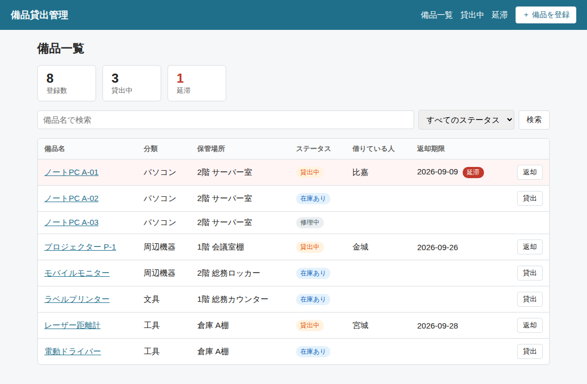

# 備品貸出管理システム（SE仕事体験コース 完成版）

株式会社SOONESS の「SE・システム開発 仕事体験コース」で使う **完成版のサンプルアプリ** と、**体験の進め方・課題のすべて** をまとめた README です。この1ページを上から読めば、準備から提出まで進められます。



| 目次 | |
|---|---|
| [1. この体験について](#1-この体験について) | 設定、3つのリポジトリ、身につくこと |
| [2. 準備と起動](#2-準備と起動) | Docker、ダウンロード、起動、止め方、戻し方 |
| [3. 3日間の目安と進め方のルール](#3-3日間の目安と進め方のルール) | 日ごと・レベルごとの目安、カードの型、AIの使い方 |
| [4. アプリを知る](#4-アプリを知る) | 画面、業務の流れ、フォルダ構成、どこを直すか、データ構造、設定値 |
| [5. 課題カード](#5-課題カード) | Lv0 動かす ／ Lv1 数字や文言 ／ Lv2 項目や条件 ／ Lv3 構造 ／ Lv4 自由 |
| [6. デバッグのしかた](#6-デバッグのしかた) | ログ、開発者ツール、DBの中身、切り分けの順番 |
| [7. 提出と報告](#7-提出と報告) | zip、Slack 報告文テンプレ、報告会 |
| [8. よくあるエラーと対処](#8-よくあるエラーと対処) | |
| [9. 用語集](#9-用語集) | |
| [10. 続きの教材](#10-続きの教材) | auth-lab（ログイン）、bihin-app-login（合体版） |

---

## 1. この体験について

### 設定

あなたは **SOONESS開発チーム** の一員です。取引先の **株式会社うるま総合サービス**（架空。従業員約60名、清掃・設備管理・人材派遣）から次の依頼を受けて「備品貸出管理システム」を作り、**納品済み** です。それがこのリポジトリです。

> 総務部 新垣です。ノートPCやプロジェクター、工具などの貸し借りをExcelでやっていて、誰が何を持っているかわからなくなります。返ってこないものもあります。Webで管理できるようにしてほしいです。

体験では、このシステムを自分のPCで動かし、中身を読み、**顧客から次々に届く「追加の要望」（課題カード）に対応していきます**。これが実際のSEの仕事で一番多い作業（保守・改修）です。

### 3つのリポジトリ

| | リポジトリ | 役割 |
|---|---|---|
| ① | **bihin-app**（このリポジトリ） | 完成版アプリ。全員がここから始める。Lv0〜Lv3 の課題はこれを直す |
| ② | [auth-lab](https://github.com/DevSOONESSorg/auth-lab) | ログインと認証の教材。「ログインの中で何が起きているか」を4段階で学ぶ |
| ③ | [bihin-app-login](https://github.com/DevSOONESSorg/bihin-app-login) | ①に②を組み込んだ合体版。1ステップ＝1コミットの手順書つき。答え合わせにも使う |

### この体験で身につくこと

| SEの仕事 | どこで体験するか |
|---|---|
| 顧客の要望を理解する | 各カードの「顧客からの要望」を読み、あいまいな部分を見つける |
| 仕様を決める | カードの「決めること」。顧客に聞けないことは自分で決めてメモする |
| 設計する | Lv2 以降で「どのファイルの、どこを、どう変えるか」を先に書く |
| プログラムを書く | Lv1 は数字・文言、Lv2 は数行〜数十行、Lv3 は設計から |
| テストする | 各カードの「確認」。境界値（ちょうどの値）を必ず試す |
| バグを直す | 自分が作ったバグを、エラー文と手順で追いかける（[6章](#6-デバッグのしかた)） |
| 成果をまとめて報告する | 最終日に zip と報告文を Slack で提出 |

> **大切なこと：** これは「プログラミング教室」ではなく「SEの仕事の体験」です。コードを書くことより、**要望を読んで、何を作るか決めて、作って、確かめて、報告する** 流れを1周することを大事にしてください。進む速さは人によって違って構いません。

---

## 2. 準備と起動

### 必要なもの

| もの | 説明 |
|---|---|
| Docker Desktop | アプリを動かす箱。体験用PCには入っています。自分のPCなら https://www.docker.com/products/docker-desktop/ から（Windows は WSL2 が必要） |
| VS Code | コードを書くエディタ。拡張機能「Japanese Language Pack」「SQLite Viewer」があると便利 |
| ブラウザ | Chrome または Edge。開発者ツール（F12）を使います |
| ターミナル | Windows は PowerShell、Mac は ターミナル |

### 最短手順（慣れている人向け）

```bash
git clone https://github.com/DevSOONESSorg/bihin-app.git taiken-yamada   # 自分の名前入りで
cd taiken-yamada
docker compose up
```

起動したらブラウザで http://localhost:3000 を開きます。くわしい手順が要らない人は [止める・直す・戻す](#止める直す戻す) へ。

### 手順（くわしく）

#### ① ターミナルを開く

| OS | 開き方 |
|---|---|
| Windows | スタートメニューで「PowerShell」と入力して開く |
| Mac | `Command + Space` で Spotlight を開き、「ターミナル」と入力して開く |

#### ② 置き場所のフォルダに移動する

どこに置いてもかまいませんが、迷ったら「デスクトップ」にしましょう。

```bash
cd ~/Desktop
```

> Windows で OneDrive を使っている場合、デスクトップが `~/OneDrive/Desktop` にあることがあります。うまく移動できないときはこちらを試してください。

#### ③ アプリをダウンロードして、自分の名前を付ける

**方法A：git clone（おすすめ）**

1. 次のリンクをコピーします

   ```
   https://github.com/DevSOONESSorg/bihin-app.git
   ```

2. ターミナルに `git clone ` と入力します（**clone のあとに半角スペース**を1つ）
3. 続けてリンクを貼り付けます（Windows：`Ctrl + V` または右クリック／Mac：`Command + V`）
4. さらに半角スペースを入れて、自分の名前入りのフォルダ名（半角英数字）を付け、`Enter`

   ```bash
   git clone https://github.com/DevSOONESSorg/bihin-app.git taiken-yamada
   ```

5. `taiken-yamada` というフォルダができればダウンロード完了です

> `git: command not found`（Mac では「開発者ツールをインストールしますか？」という画面）が出たら、Git がまだ入っていません。Mac はその画面で「インストール」を押せば入ります。Windows は https://git-scm.com/ からインストールするか、方法Bを使ってください。

**方法B：zip でダウンロード**

1. ブラウザで https://github.com/DevSOONESSorg/bihin-app を開く
2. 緑色の **Code** ボタン → **Download ZIP**
3. ダウンロードした zip をデスクトップに移して解凍する
4. できたフォルダ名 `bihin-app-main` を、自分の名前入り（例：`taiken-yamada`）に変える

> フォルダ名は半角英数字にしてください。日本語だと Docker が起動できません。

#### ④ アプリのフォルダに移動する

```bash
cd taiken-yamada
```

次のコマンドで中身を確認し、`docker-compose.yml` や `README.md` が表示されれば正しい場所にいます。

```bash
ls
```

#### ⑤ 起動する（初回はイメージの作成に1〜2分かかります）

Docker Desktop が起動している（クジラのアイコンが running）ことを確認してから：

```bash
docker compose up
```

#### ⑥ 起動を確認する

ターミナルに次の行が出たら起動完了です。

```
備品貸出管理 を起動しました → http://localhost:3000
```

ブラウザで http://localhost:3000 を開き、備品一覧（サンプル8件、延滞1件）が出れば成功です。

> 起動中は、このターミナルを**閉じないでください**（閉じるとアプリも止まります）。ほかの作業をするときは、新しいターミナルを開きましょう。

#### 2回目以降の起動

ダウンロード（③）は最初の1回だけです。2回目からは、フォルダに移動して起動するだけ。

```bash
cd ~/Desktop/taiken-yamada
docker compose up
```

### 止める・直す・戻す

| したいこと | やること |
|---|---|
| 止める | アプリを動かしているターミナルで `Ctrl + C`（Mac も `Ctrl`）→ `docker compose down` |
| コードを直した | **何もしなくてよい。** 保存すると自動で再起動します（ターミナルに `Restarting`）。ブラウザを再読み込み |
| `package.json` を変えた | パッケージを追加したときだけ `docker compose up --build` |
| データを最初に戻す | 止めてから `docker compose run --rm app npm run reset`。または `data/bihin.db` を削除。次回起動時にサンプルが入り直す |

### 自分用の名前とポートを付ける（お手本と並べて動かす）

`.env.example` をコピーして `.env` を作り、書き換えます。

```
APP_NAME=山田の備品管理
PORT=3001
```

画面左上の名前が変わり、http://localhost:3001 で開けます。元の bihin-app をもう1つ 3000 番で動かしておけば、「お手本」と「自分のもの」を見比べられます。`.env` は Git には含まれません。

### Docker を使わずに動かす

Node.js 20 以上があれば `npm install` → `npm run dev` で http://localhost:3000 に起動します。

---

## 3. 3日間の目安と進め方のルール

### 日ごとの目安

| 日 | 全員 | 進んだ人 |
|---|---|---|
| Day 1 | 準備 → Lv0 → Lv1 を2〜3枚 | Lv1 全部 → Lv2 着手 |
| Day 2 | Lv1 の残り → Lv2 を1〜2枚 | Lv2 を3枚以上 → Lv3 の設計メモ |
| Day 3 | Lv2 の続き → zip と報告文 → 報告会 | Lv3 の実装 → 提出・報告会 |
| Day 4〜5（延長） | Lv2 の残り、または auth-lab 第1〜2段 | Lv3 の続き、auth-lab 第3〜4段、合体、Lv4 |

### 到達の目安（これより遅くても問題ありません）

| あなたが… | 3日間の到達目安 |
|---|---|
| プログラミングは初めて | Lv0 → Lv1 を4〜6枚 → Lv2 を1枚。「要望を読んで、変えて、確かめて、報告する」を3回繰り返せていれば十分 |
| 学校や独学で少し書いた | Lv1 全部 → Lv2 を3枚 → Lv3 の設計メモ |
| 趣味でアプリを作った | Lv2 全部 → Lv3 を1枚 → auth-lab 第1段 |
| エンジニア経験がある | Lv0〜2 を90分で通過 → Lv3 を2枚 → auth-lab → 合体 → Lv4 |

「今日はここまでで止める」を自分で決めてよいです。進んだ量は評価しません。報告会で「SEの仕事ってこういうことか」と自分の言葉で言えることがゴールです。

### カードの進め方（毎回同じ型）

1. **要望を読む**：顧客のメールを読み、「何を求めているか」を1行で言い換える
2. **決める**：メールに書かれていないことを自分で決めてメモする（顧客には聞けない設定。実際のSEも「仮に決めて、あとで確認する」をよくやる）
3. **触る場所を決める**：[4-4 の表](#4-4-何を変えたいか--どのファイルを触るか)で、どのファイルのどこを変えるかを決める。Lv2 以上は先にメモに書く
4. **変える**：小さく変えて、保存して、ブラウザで見る。一度にたくさん変えない
5. **確かめる**：カードの「確認」をすべて試す。「ちょうどの値」（境界値）を必ず入れる
6. **記録する**：日誌に「何を変えたか、どう確かめたか、迷ったこと」を1〜3行

### AI（ChatGPT / Claude など）の使い方

使ってよいです。実務でも使います。ルールは次のとおり。

| 場面 | OK | NG |
|---|---|---|
| エラーが出た | エラー文をそのまま貼って「意味と、どのファイルを見ればいいか」を聞く | — |
| 貼る場所が分からない | 「このコードを index.ejs のどこに貼るか」を聞く | — |
| Lv1・Lv2 | 自分が書いたコードの意味を説明してもらう | ファイルを丸ごと書き直させる |
| Lv3 以上 | 自由。ただし設計は自分で決めてから | 設計から丸投げ |
| いつでも | AIに聞いたことを日誌に書く | 説明できないコードをそのまま使う |

**「説明できないコードは使わない」** が実務のルールです。報告会で「このコードは何をしていますか」と聞かれて答えられる状態にしてください。

### 詰まったときの3ステップ

1. **エラー文を読む**：ターミナルの赤い文字にファイル名と行番号がある。まずそこを開く
2. **お手本と見比べる**：元の bihin-app（GitHub か、3000番で動かしているもの）と自分のファイルを比べる。Lv3 は bihin-app-login に答えがある
3. **人に聞く**：サポーターに「**どのファイルを・どう変えたら・何が起きたか**」の3つを伝える。「動きません」だけでは答えられない

15分考えて進まなければ聞いてください。抱え込むのは実務でも良くないことです。

### 変更を残す

Git を使える人はカード1枚ごとに `git commit`（例：`Lv1-1: 返却期限を7日に変更`）。使わない人は、カードが終わるごとにフォルダを丸ごとコピーしてバックアップ（`taiken-yamada_Lv1-3まで` など）。

---

## 4. アプリを知る

### 4-1. できること・画面

| 画面 | URL | できること |
|---|---|---|
| 備品一覧 | `/items` | 全備品の一覧。備品名で検索、ステータスで絞り込み。登録数／貸出中／延滞の件数 |
| 備品の登録・編集 | `/items/new`、`/items/3/edit` | 備品名（必須・50文字以内）、分類、保管場所、ステータス、メモ |
| 備品詳細 | `/items/3` | 1つの備品の情報と貸出履歴。貸出・返却・編集・削除 |
| 貸出登録 | `/loans/new/3` | 借りる人、貸出日、返却期限（貸出日の14日後が自動で入る） |
| 貸出中一覧・延滞一覧 | `/loans`、`/loans?overdue=1` | 返っていない備品の一覧。期限を過ぎたものは赤く表示 |

「ログイン」「複数拠点」「消耗品（数量管理）」「メール通知」はあえて入れていません。課題として登場します。

### 4-2. 業務の流れ

```
登録（在庫あり） → 貸出（貸出中） → 期限超過で延滞表示 → 返却（在庫ありに戻る。履歴に残る）
```

- 「修理中」の備品は貸し出せない
- 貸出中の備品は削除できず、編集画面でステータスを手で変えられない（先に返却が必要）
- 延滞 ＝ 返却日が空で、返却期限が **今日より前**（期限当日はまだ延滞ではない）

### 4-3. フォルダ構成

```
bihin-app/
├── README.md            ← このファイル
├── docker-compose.yml   ← Docker の起動設定（ポート、フォルダの共有）
├── Dockerfile           ← Docker イメージの作り方
├── .env.example         ← 設定のひな形（コピーして .env にする）
├── package.json         ← 使うパッケージと npm run のコマンド
│
├── src/                 ← ★アプリ本体。課題で触るのはほぼここ
│   ├── server.js        ← 起動の入口。URLと処理の対応表
│   ├── config.js        ← ★設定値（返却期限の日数、ステータス名、文字数制限、分類）
│   ├── db.js            ← ★テーブル定義とサンプルデータ
│   ├── dates.js         ← 日付の計算（今日、n日後、延滞かどうか）
│   ├── reset.js         ← データを初期化するスクリプト
│   ├── routes/
│   │   ├── items.js     ← ★備品の 一覧・登録・詳細・編集・削除
│   │   └── loans.js     ← ★貸出中一覧・貸出登録・返却
│   └── views/           ← ★画面（HTMLのテンプレート。拡張子 .ejs）
│       ├── partials/header.ejs, footer.ejs  ← 全画面共通
│       ├── items/index.ejs   ← 備品一覧
│       ├── items/form.ejs    ← 備品の登録・編集フォーム（共用）
│       ├── items/show.ejs    ← 備品詳細と貸出履歴
│       ├── loans/index.ejs   ← 貸出中一覧・延滞一覧
│       ├── loans/form.ejs    ← 貸出登録フォーム
│       └── error.ejs
│
├── public/style.css     ← ★見た目（色・余白・表のデザイン）
├── data/                ← データベースファイル bihin.db が作られる
└── docs/images/         ← スクリーンショット
```

### 4-4. 「何を変えたいか」→「どのファイルを触るか」

**この表が読めるようになることが Lv1 のゴールです。**

| 変えたいこと | 触るファイル | 例 |
|---|---|---|
| 数字・選択肢・ステータス名 | `src/config.js` | 返却期限14日→7日、分類に「車両」 |
| 画面の文言・並び・ボタン | `src/views/` の .ejs | 列の見出し、ボタンの名前 |
| 色・余白・大きさ | `public/style.css` | 会社の色に変える |
| 動き・計算・条件 | `src/routes/`、`src/dates.js` | 延滞の判定、検索条件、入力チェック |
| 保存する項目を増やす | `db.js` ＋ `routes/` ＋ `views/` の3か所 | 備品に「管理番号」 |
| 新しい画面を作る | `routes/` に処理 ＋ `views/` に画面 ＋ `server.js` に登録 | マイページ |

### 4-5. 処理の流れ（`/items` を開いたとき）

1. `src/server.js` が「`/items` で始まるURLは `routes/items.js` に任せる」と振り分ける
2. `routes/items.js` の `router.get('/')` が動き、`db.js` 経由で SQLite から備品を取り出す
3. `views/items/index.ejs` に渡して HTML を組み立てる
4. `public/style.css` で見た目が整えられて表示される

フォームで保存を押したときは逆向きです：ブラウザ → `router.post(...)` が値を受け取る → 入力チェック → SQLite に INSERT / UPDATE → 一覧へ戻す（redirect）。

> **読むコツ：** `server.js` を上から読む（30行）→ `routes/items.js` の `router.get('/')` だけ読む → `views/items/index.ejs` の `<% for (const item of items) %>` を読む。この3か所で「一覧が出る仕組み」が分かります。

### 4-6. データの構造

SQLite で `data/bihin.db` の1ファイル。テーブルは2つ。

**items（備品）**

| 列 | 型 | 内容 |
|---|---|---|
| id | INTEGER | 番号（自動） |
| name | TEXT | 備品名（必須） |
| category | TEXT | 分類 |
| location | TEXT | 保管場所 |
| status | TEXT | `available`（在庫あり）／`lent`（貸出中）／`repair`（修理中） |
| note | TEXT | メモ |
| created_at | TEXT | 登録日時 |

**loans（貸出記録）**

| 列 | 型 | 内容 |
|---|---|---|
| id | INTEGER | 番号（自動） |
| item_id | INTEGER | どの備品か（items.id） |
| borrower | TEXT | 借りた人 |
| lent_on | TEXT | 貸出日（YYYY-MM-DD） |
| due_on | TEXT | 返却期限（YYYY-MM-DD） |
| returned_on | TEXT | 返却日。**空なら「まだ返っていない」** |
| created_at | TEXT | 記録日時 |

1つの備品に対して「返却日が空の貸出記録」は同時に1件だけ。日付を TEXT で持っているのは SQLite の公式の推奨（日付型がなく、ISO形式の文字列なら比較で正しく並ぶ）です。

### 4-7. 設定で変えられること（`src/config.js`）

| 設定 | 初期値 | 意味 |
|---|---|---|
| `APP_NAME` | 備品貸出管理 | 画面左上の名前（`.env` が優先） |
| `DEFAULT_LOAN_DAYS` | 14 | 貸出時に自動で入る返却期限（何日後か） |
| `ITEM_NAME_MAX` | 50 | 備品名の最大文字数 |
| `BORROWER_MAX` | 30 | 借りる人の名前の最大文字数 |
| `STATUS_LABELS` | 在庫あり／貸出中／修理中 | ステータスの表示名 |
| `CATEGORIES` | パソコン／周辺機器／工具／文具／その他 | 分類の選択肢 |
| `ITEM_SORT` | name | 一覧の並び順。`name`＝名前順、`newest`＝新しい順 |

---

## 5. 課題カード

全員 Lv0 から始めます。各カードは「顧客からの要望／触る場所／決めること／手順／確認」の同じ型です。エンジニア経験がある人は Lv0〜Lv2 を90分程度で通過して Lv3 へ進んで構いません。

### Lv0 ― 動かして理解する

#### Lv0-1 お手本を触って、業務を理解する（20〜30分）

1. 備品一覧の「登録数／貸出中／延滞」の数字を確認する
2. 「ノートPC A-01」を開く。誰がいつ借りて、返却期限はいつか、なぜ「延滞」かを確認する
3. 「モバイルモニター」を貸し出す（借りる人は自分の名前）。返却期限に何日後が入るか確認する
4. 一覧で自分が借りたものが「貸出中」になっていることを確認する
5. 返却する。詳細画面の「貸出履歴」に記録が残っていることを確認する
6. 新しい備品を登録する。備品名を空で保存しようとするとどうなるか試す
7. 「修理中」の備品（ノートPC A-03）を貸し出そうとするとどうなるか試す

確認：☐「延滞」の意味を自分の言葉で言える（期限当日は延滞か？）　☐ 貸出中の備品を削除しようとするとどうなるか分かった

#### Lv0-2 コードを3か所だけ読む（20〜30分）

1. `src/config.js` を全部読む（40行）。「返却期限14日」「備品名50文字」「ステータスの名前」がここにある
2. `src/routes/items.js` の `router.get('/'` の部分だけ読む。「検索条件を組み立て → SQLで取り出し → 画面に渡す」の3段
3. `src/views/items/index.ejs` の `<tbody>` の中を読む。`<% for (const item of items) { %>` が「備品の数だけ行を繰り返す」

確認：☐「返却期限の日数を変えたいならどのファイルか」に即答できる　☐ 一覧の「保管場所」の列が index.ejs のどの行で出ているか指させる

### Lv1 ― 数字や文言を変える

触るのは1ファイル・1〜数行。「要望 → 触る場所を見つける → 変える → 確かめる」の型を体に入れる段階。3枚以上やってから Lv2 へ。

#### Lv1-1 返却期限を短くしたい（config.js／10分）

> 新垣です。2週間だと長すぎて返ってこないので、貸出のときに自動で入る返却期限を**1週間**にしてください。

- 触る場所：`src/config.js` の `DEFAULT_LOAN_DAYS: 14` → `7`
- 確認：☐ 貸出登録画面の返却期限が今日の7日後　☐ すでに貸出中のものの期限は変わらない。なぜか（DBに保存済みの値は変わらない）

#### Lv1-2 ステータスの言い方を変えたい（config.js／10分）

> 社内では「在庫あり」ではなく「貸出可」、「貸出中」ではなく「使用中」と呼んでいます。

- 触る場所：`src/config.js` の `STATUS_LABELS`
- 決めること：左側（`available` など DBに入る値）は変えない。右側（表示）だけ変える。なぜ左を変えてはいけないか
- 確認：☐ 一覧・詳細・登録フォームの選択肢・検索の絞り込み、4か所すべて新しい呼び方　☐ 変える前のデータも正しく表示される

#### Lv1-3 分類を増やしたい（config.js／10分）

> 社用車の鍵も備品として管理したいので、分類に「車両」を足してください。

- 触る場所：`src/config.js` の `CATEGORIES`
- 確認：☐ 登録フォームに「車両」が出る　☐「車両」で登録して一覧に出る　☐「パソコン」を削除すると、登録済みの「パソコン」の備品の編集画面で分類はどうなるか（小さなバグの種。見つけたら日誌に）

#### Lv1-4 一覧を新しい順にしたい（config.js／10分）

> 最近登録したものを上に出してほしいです。

- 触る場所：`src/config.js` の `ITEM_SORT: 'name'` → `'newest'`
- 読む：`routes/items.js` で `ITEM_SORT` がどう使われているか（`ORDER BY`）
- 確認：☐ 新しく登録した備品が一番上　☐ 発展：`'category'` を入れるとどうなるか。対応させるにはどこを直すか

#### Lv1-5 会社の色にしたい（style.css／15分）

> コーポレートカラーは緑（#2e7d32）なので、上のバーとボタンを緑にしてください。

- 触る場所：`public/style.css` 先頭の `:root` にある `--color-primary` と `--color-primary-dark`
- 決めること：`--color-primary-dark`（マウスを乗せたときの色）を何にするか
- 確認：☐ バー・リンク・ボタンが緑　☐ 変わらなかった場所はなぜか（`.badge-available` は別の色を直接指定している）

#### Lv1-6 備品名の文字数を制限したい（config.js／10分）

> 備品名が長すぎると一覧が崩れるので、30文字までにしてください。

- 触る場所：`src/config.js` の `ITEM_NAME_MAX: 50` → `30`
- 読む：`routes/items.js` の `validateItem` 関数
- 確認（境界値）：☐ ちょうど30文字は登録できる　☐ 31文字は「30文字以内にしてください」で登録できない

**Lv1 を終えたら**、日誌に「一番迷った『決めること』」「触る場所を自分で見つけられた枚数」を書いてください。ここまでで「SEの仕事の1周」は体験できています。

### Lv2 ― 項目や条件を足す

触るのは複数ファイル。**アプリの中にある「似た仕組み」を見つけて真似する**段階。答えはすべてアプリの中にあります。

> **Lv2 から必ず守ること：** 作る前に「触るファイルと、変える内容」をメモに書く。サポーターに見せてから始めると手戻りが減ります。

#### Lv2-0 保管場所とメモにも文字数チェックを付けたい（準備運動／30分）

> 保管場所に100文字入れても登録できてしまいました。備品名と同じように制限してください。メモも上限がほしいです。

- 決めること：保管場所は何文字まで（50？）。メモは（200？500？）。上限は `config.js` に置くか直接書くか
- 真似する仕組み：`routes/items.js` の `validateItem`。備品名の2行（空チェック・文字数チェック）が手本。`errors.push(...)` を足すだけ
- 手順：① `config.js` に `LOCATION_MAX: 50`、`NOTE_MAX: 200` を足す → ② `validateItem` に保管場所とメモのチェックを足す → ③ 備品名を空・保管場所51文字・メモ201文字にして保存
- 確認：☐ エラーが **3つ同時に** 表示される（エラーは配列で、画面は全部ループして出す作り）　☐ ちょうど50文字・200文字は通る　☐ 編集画面でも同じチェックが効く（`router.post('/:id')` も `validateItem` を使っている）
- 気づいてほしいこと：**仕様書に書いていないことは実装されていない。** それを見つけるのもSEの仕事

#### Lv2-1 備品に「管理番号」を付けたい（60〜90分）

> 備品にはシールで管理番号（例：PC-0012）を貼っています。登録するときに入力して、一覧と詳細に出してください。

- 決めること：必須か／重複を許すか／何文字までか／一覧のどの列の位置か
- 真似する仕組み：「保管場所（location）」。`location` を全ファイルで検索すると触る場所がすべて見つかる
- 手順：
  1. `src/db.js` の `items` に `asset_no TEXT NOT NULL DEFAULT ''` を足す（`location` の行の次）
  2. **古いDBを消す**：止めて `docker compose run --rm app npm run reset`（列を足しても既存のDBファイルには反映されない）
  3. `views/items/form.ejs`：保管場所の `<label>` をコピーして `asset_no`「管理番号」に
  4. `routes/items.js`：`router.post('/')` と `router.post('/:id')` の INSERT / UPDATE に `asset_no` を足す
  5. `views/items/index.ejs` と `show.ejs` に表示を足す
- 確認：☐ 登録→一覧→詳細→編集→保存で消えない　☐ 空で登録したときの動きが「決めること」どおり
- よくある失敗：`no such column: asset_no` → 手順2を忘れている。空欄になる → `name="asset_no"` と `req.body.asset_no` の綴り違い

#### Lv2-2 延滞判定で土日を数えないでほしい（45〜60分）

> 金曜に借りて月曜に返す人が「延滞」になるのは変です。土日は数えないでほしいです。

- 決めること（重要）：(A) 返却期限を決めるときに土日を飛ばす（7営業日後）か、(B) 期限が土日なら次の月曜にずらすか。祝日は考えない
- 触る場所：`src/dates.js`。(A) なら `addBusinessDays` を新しく作り `routes/loans.js` で使う。(B) なら「土日なら月曜へ」の関数を1つ足す。ヒント：`new Date(ymd + 'T00:00:00').getDay()` は 0=日曜、6=土曜
- 確認（境界値）：☐ 金曜に貸すと期限は何曜日か、紙に書いてから確かめる　☐ 期限がちょうど土曜・日曜になるケース（貸出日を手で過去にして試す）

#### Lv2-3 返却期限の3日前から黄色で表示したい（45〜60分）

> 延滞になってから気づくのでは遅いので、期限の3日前から一覧で目立つようにしてください。

- 真似する仕組み：「延滞（overdue）」。`overdue` を全ファイルで検索すると、判定（dates.js）→ 付与（routes）→ 表示（views の `row-overdue`）→ 色（css）の4段が見える。同じ4段で `dueSoon` を作る
- 決めること：「3日前」は当日を含むか。延滞と両方当てはまるときどちらを優先するか
- 確認：☐ 期限が3日後・2日後・1日後・当日・過ぎている、の5通りで色を確かめる　☐ 返却済みには色が付かない

#### Lv2-4 保管場所でも検索したい（30〜45分）

> 「倉庫」と入れたら倉庫にある備品が全部出るようにしてほしいです。

- 決めること：今の検索欄を「備品名 **または** 保管場所」にするか、欄を分けるか
- 触る場所：`routes/items.js` の `router.get('/')` にある `where.push('items.name LIKE ?')`。SQL の `OR` と、`params` に値を2回入れる必要があることに注意
- 確認：☐「倉庫」で2件出る　☐「ノート」で今までどおり　☐ 空で全件　☐ ステータス絞り込みと同時に使える

#### Lv2-5 貸出のときに「用途」を必須で入れてほしい（45〜60分）

> 何に使うのか分からないまま貸しているので、貸出時に用途（現場作業、会議など）を必ず入れてもらい、履歴にも残してください。

- 真似する仕組み：Lv2-1 と同じ流れを `loans` テーブルに対して。入力チェックは `routes/loans.js` の `errors.push(...)` を真似る
- 確認：☐ 用途が空だと貸出できない　☐ 詳細の貸出履歴に用途が出る　☐ DBリセットで Lv2-1 のデータも消えることに気づく（実務なら「マイグレーション」）

#### Lv2-6 備品に写真を付けたい（90分〜）

> 名前だけだと似た備品を間違えるので、写真を登録して一覧と詳細に出してください。

- 決めること：画像の保存場所（`public/uploads/` にファイル、DBにはファイル名だけ、が定石）。サイズ・形式の制限。写真なしの見せ方
- 必要なもの：`multer` パッケージ。`package.json` に足して `docker compose up --build`。フォームに `enctype="multipart/form-data"`
- 確認：☐ 写真つきで登録 → 一覧にサムネイル、詳細に大きく　☐ 写真なしでも壊れない　☐ 備品を削除したとき画像ファイルはどうなるか

#### Lv2-7 借りている人の名前でも検索したい（45分）

> 「比嘉さんが今何を借りているか」を一覧ですぐ出したいです。

- 決めること：検索欄を共用にするか分けるか。返却済みの過去の借り手も対象にするか（今借りている人だけか）。この決定で SQL が大きく変わる
- 触る場所：`routes/items.js` の一覧 SQL（`SELECT_ITEM_WITH_LOAN`）はすでに `loans` を `LEFT JOIN` して `borrower` を取っているので、`where.push('loans.borrower LIKE ?')` を足せば「今借りている人」で絞れる
- 確認：☐「比嘉」で比嘉さんが今借りている備品だけ出る　☐ 返却後は出なくなる　☐ 備品名検索との組み合わせ（AND か OR か）が決定どおり

#### Lv2-8 貸出日に過去の日付が入ってしまう（45分）

> 貸出日や返却期限に先月の日付を入れても登録できました。貸出日は今日で固定してよいので、入力をなくしてください。

- 決めること（ここが本題）：本当に固定してよいか。**「先週貸したのを記録し忘れていた」ケース**はこの会社にあるか。(A) 顧客の言うとおり今日で固定、(B) 入力は残すが未来日は禁止、(C) 過去日は確認メッセージ。**顧客の要望をそのまま実装しない判断**もSEの仕事。自分の案と理由を日誌に書いてから実装
- 触る場所：(A) なら `loans/form.ejs` の貸出日を `readonly` にし、`routes/loans.js` で `lentOn = dates.today()` に固定。画面で隠しても POST で過去日を送れるので、**サーバー側で固定することが本体**
- 確認：☐ 貸出日が今日になり変えられない（開発者ツールで readonly を外して送っても今日）　☐ 返却期限を今日より前にしたときの扱いが決定どおり

> Lv2-0、2-7、2-8 は、このアプリを実際に1時間半触った人が見つけた「仕様の穴」です。完成版にもこうした穴は普通にあります。見つけたら「バグか、仕様が決まっていないだけか」を考え、報告文に書いてください。次の参加者の課題になります。

### Lv3 ― 構造を変える

真似できる仕組みがありません。**テーブルや画面の構造そのものを設計する**段階です。実装の前に **設計メモ（1ページ）** を書き、サポーターに見せてください。設計メモに書くこと：①誰が何をできるようになるか ②テーブルの変更 ③画面の変更（ラフ絵） ④既存データへの影響 ⑤作る順番。

#### Lv3-1 借りる人を登録済みの社員から選びたい（設計30分＋実装2〜4時間）

> 借りる人を手で打つと「比嘉」「比嘉さん」「ひが」がバラバラに入ります。社員一覧から選ぶようにできませんか。

- 設計の分かれ道：(A) 社員テーブル `employees` をこのアプリに作り登録画面も作る／(B) 社員データは別システム（社員マスタAPI）から取ってきて持たない。さらに `loans.borrower` は名前のままか社員番号か。**既存の貸出データはどうなるか**
- 答え合わせ：(B) の実装例が [bihin-app-login の Step 10](https://github.com/DevSOONESSorg/bihin-app-login/blob/main/docs/merge-guide.md) にあります。設計メモを書いてから見ること
- 確認：☐ 貸出フォームで社員を選べる　☐ 過去の履歴が壊れない　☐ 社員一覧が取れないときの動き

#### Lv3-2 コピー用紙やトナーも管理したい（数量管理）（設計45分＋実装3〜5時間）

> 消耗品も一緒に管理したいです。残りがいくつあって、誰がいくつ持っていったか分かるように。

- 設計の分かれ道：今は「1点ずつ貸して返す」モデル。消耗品は「数量があって、減って、補充されて、返ってこない」モデル。同じテーブルに種別を持たせて分岐するか、消耗品用のテーブルと画面を別に作るか。ステータスは消耗品に意味があるか
- これは何の練習か：「今ある仕組みに無理に乗せるか、分けるか」の判断。設計メモの「理由」を一番大事にする
- 確認：☐ 登録・持ち出しで減る・補充で増える　☐ 既存の備品の貸出・返却が今までどおり　☐ 残数0で持ち出そうとするとどうなるか

#### Lv3-3 拠点が2つに増えた（設計30分＋実装2〜4時間）

> 来月から那覇営業所ができます。拠点ごとに備品を分けて管理し、一覧は拠点で切り替えたいです。

- 設計の分かれ道：`items` に `site` 列を足すだけか、`sites` テーブルを作るか。URL は `/items?site=naha` か `/sites/naha/items` か。件数は拠点ごとか全体か。既存の備品はどの拠点にするか
- 確認：☐ 拠点を切り替えると一覧が変わる　☐ 登録時に拠点を選べる　☐ 貸出中・延滞一覧も拠点で絞れる

#### Lv3-4 総務だけが登録・削除できるようにしたい（ログイン）

> 今は誰でも備品を消せてしまうので、登録・編集・削除・貸出・返却は総務だけにして、一般社員は見るだけにしてほしいです。

- 進め方：専用の教材があります。① [auth-lab](https://github.com/DevSOONESSorg/auth-lab) 第1段でログインの仕組みを体験 → ② [bihin-app-login の手順書](https://github.com/DevSOONESSorg/bihin-app-login/blob/main/docs/merge-guide.md) Step 1〜8 を自分のフォルダに対して行う（1ステップ＝1コミットで差分が見られる）
- これは何の練習か：他人が作った部品（`auth/`）を自分のアプリに壊さず組み込む。実務のライブラリ導入と同じ
- 確認：☐ ログインしないと一覧が見られない　☐ 一般社員で `/items/new` を直接開くと 403　☐「ボタンを隠すだけではダメな理由」を自分の言葉で言える

#### 設計メモの記入例（Lv3-1）

| 項目 | 記入例 |
|---|---|
| 誰が何をできるように | 総務が貸出登録のとき、社員一覧から借りる人を選べる。手入力もできる |
| テーブルの変更 | なし。`loans.borrower` は名前の文字列のまま（既存データを移行しなくて済む） |
| 画面の変更 | 貸出フォームの「借りる人」を `<select>` に。取得できなければ今までの `<input>` |
| 既存データへの影響 | なし |
| 作る順番 | ①API を起動して curl で取れることを確認 → ②routes/loans.js で取得 → ③form.ejs をセレクトに → ④API を止めて手入力に戻ることを確認 |

### Lv4 ― 自由課題（エンジニア経験者向け）

順不同。終わらない量にしてあります。着手前に「何を・なぜ・どう確かめるか」を1枚書き、終わったら PR（または zip）と一緒に提出。「動くこと」より「判断の説明」を評価します。

| 課題 | 内容 | 問われること |
|---|---|---|
| 一覧を JSON API にする | `GET /api/items` を作り `?status=lent` で絞れるように。一覧画面は fetch で描画。Postman で確認 | レスポンスの形、エラー時のステータスコード、画面とデータの分離 |
| CSV 出力 | 貸出履歴を CSV で。Excel で開ける UTF-8 BOM、名前に「,」が入る場合 | 顧客の環境を想定できるか |
| 自動テスト | `node:test` で `dates.js` の `isOverdue` と営業日計算をテスト。境界値を網羅 | 境界値の洗い出し |
| 日付を「日付型」で持つ | 今は SQLite なので `'YYYY-MM-DD'` の TEXT（SQLite の公式推奨）。MySQL / PostgreSQL に移すなら `DATE` 型にし、比較を DB 側の日付関数に寄せる | 「TEXT だからダメ」ではなく「このDBでは何が正しいか」 |
| マイグレーション | 「DBを消して作り直す」をやめ、既存データを残したまま列追加する仕組み | 本番運用を想定した変更管理 |
| API 認証を JWT に | bihin-app-login の api を `API_AUTH_MODE=jwt` に。auth-lab 第3段 | サービス間認証 |
| Laravel 等に移植 | 同じ機能を別のフレームワークで。テーブル設計は変えない | 流儀の違いを説明できるか |
| GitHub Actions | push のたびに自動テスト | CI の最小構成 |
| 教材そのものを直す | この README・コード・手順書で分かりにくかった点を直して PR | 次の参加者のための改善。最終日に発表 |

---

## 6. デバッグのしかた

バグ探しは勘ではなく手順です。**①どこで止まっているかを見つける → ②その場所の値を見る → ③期待と違う値を直す**。道具は4つ。

### 道具1：ターミナルのログ（サーバー側で何が起きたか）

`docker compose up` しているターミナルにエラーの全文が出ます。赤い文字の最初の数行に **ファイル名と行番号** があります（例：`at /app/src/routes/items.js:63:21` → items.js の63行目）。まずそこを開く。

値を確かめたいときは `console.log` を1行入れて保存（自動で再起動）。ブラウザで操作するとターミナルに値が出ます。

```js
router.post('/', (req, res) => {
  console.log('受け取った値:', req.body);     // フォームから何が届いたか
  const errors = validateItem(req.body);
  console.log('チェック結果:', errors);        // なぜ弾かれたか
  ...
```

別のターミナルでログだけ見る：`docker compose logs -f app`。確認が終わったら `console.log` は消す。

### 道具2：ブラウザの開発者ツール（ブラウザとサーバーの間で何が流れたか）

F12（Mac は Cmd + Option + I）。使うタブは3つ。

| タブ | 見るもの | こんなときに |
|---|---|---|
| Network | フォームを送ったときの通信。行をクリック → **Payload** に送った値、**Response** に返ってきた中身、**Status** に番号 | 「保存したのに入っていない」→ 本当に送られたか、サーバーが何を返したか |
| Console | 画面側（JavaScript）のエラー | 画面が崩れる、ボタンが効かない |
| Elements | 今表示されている HTML | `<% if %>` が効いているか、`name="..."` の綴り |

Status の読み方：200＝正常表示、302＝別ページへ移動（保存成功の合図）、400＝入力チェックで弾かれた、403＝権限なし、404＝URLが違う、500＝サーバー側でエラー（ターミナルを見る）。

### 道具3：データベースの中身を直接見る

VS Code の拡張機能 **SQLite Viewer** で `data/bihin.db` を開くと表として見られます。コマンドなら：

```bash
docker compose exec app node -e "
const db = require('better-sqlite3')('data/bihin.db');
console.table(db.prepare('SELECT id, name, location, status FROM items').all());
"
```

### 道具4：半分ずつ消す（二分探索）

見当がつかないときは、直した部分を半分コメントアウト（`//`）して動かし、直るかどうかで原因の範囲を半分に絞る。数回で1行に絞れます。**一度にたくさん変えないこと**が一番のデバッグ対策。

### 切り分けの順番（迷ったらこの順に）

1. **ブラウザに何が出ているか**：エラー画面？真っ白？古い画面のまま？（古いままならスーパーリロード）
2. **Network の Status**：400 なら入力チェック、500 ならサーバー、302 なのに反映されないなら DB か表示側
3. **ターミナルの赤い文字**：ファイル名と行番号へ
4. **その行の前後に console.log**：値が期待どおりか
5. **DB を直接見る**：保存はできているか
6. **お手本と比べる**：元の bihin-app の同じファイルと見比べる

> デバッグも「報告」の材料です。「Network で 400 が返っていて、ログを見たら errors に『備品名を入力してください』が入っていた。原因はフォームの name 属性の綴り違いだった」まで言えれば、立派なSEの仕事です。日誌に書いてください。

---

## 7. 提出と報告

### 提出するもの

1. **自分のフォルダを zip にしたもの**（例：`taiken-yamada.zip`）。コードとデータ（`data/bihin.db`）が入る
2. **報告文**（下のテンプレ）。Slack の体験チャンネルに zip と一緒に投稿
3. Lv2 以上をやった人は **設計メモ**（紙なら写真）

### カードごとに小さく提出してもよい（おすすめ）

1枚のカードが終わるたびに提出すると、変更が混ざらず確認しやすくなります。Slack に次の3つを投稿してください。

1. **画面キャプチャ**：変更した機能が動いている画面（変更前・変更後の2枚があるとベスト）
2. **変更内容**：git clone した人は、アプリのフォルダで次を実行すると変更の差分が `kadai_Lv1-1.txt` に保存されます（カード名に合わせてファイル名を変える）。zip でダウンロードした人は、変更したファイルをそのまま添付

   ```bash
   git diff > kadai_Lv1-1.txt
   ```

3. **作業報告（3行）**：どのファイルを変えたか／どう確認したか（何を操作してどうなったか）／難しかったところ

最終日には、下の「提出するもの」でまとめて提出します。

### zip の作り方

1. 止める：`Ctrl + C` → `docker compose down`
2. `node_modules` フォルダがあれば削除（Docker で動かしていれば作られていない）
3. フォルダを右クリック →「圧縮」（Mac）／「送る → 圧縮フォルダー」（Windows）
4. Slack に報告文と一緒に投稿

Git を使った人は GitHub に自分のリポジトリを作って push し、URL を報告文に書いても構いません。

### 報告文テンプレ

```
【SE体験 報告】山田 太郎（Day 3）

■ どこまでやったか
Lv0、Lv1-1〜1-4、Lv2-1（管理番号）まで。Lv2-2 は設計メモまで。

■ 顧客の要望にどう対応したか（1つ選んで）
Lv2-1「管理番号を付けたい」
・決めたこと：必須にしない、重複は許す、20文字まで
・理由：シールを貼っていない古い備品もあると考えたため
・触ったファイル：db.js、items/form.ejs、routes/items.js、items/index.ejs、items/show.ejs
・確かめたこと：登録→一覧→詳細→編集で消えないこと、空で登録できること

■ 詰まったこと・どう解決したか
no such column というエラー → DBをリセットしていなかった。AIにエラー文を貼って気づいた。

■ 見つけた「仕様の穴」（あれば）

■ SEの仕事について感じたこと（2〜3行）

■ 事業所の雰囲気について（任意）
```

### 報告会（最終日 14:10〜）

一人5〜10分。画面を映しながら報告文の内容を話します。サポーターから必ず聞く質問は1つ：**「SEの仕事って、どんな仕事だと思いましたか？」**

---

## 8. よくあるエラーと対処

| 症状 | 原因と対処 |
|---|---|
| `port is already allocated` | 同じポートを別のアプリが使っている。`.env` の `PORT` を 3001 などに変える |
| `Cannot connect to the Docker daemon`／`request returned 500` | Docker Desktop が起動していない、または起動しきっていない。running になるまで待つ。直らなければ Docker Desktop を終了して起動し直す |
| `container_name ... does not match pattern` | フォルダ名に日本語や記号。半角英数字にする |
| ブラウザで「接続できません」 | まだ起動中。「起動しました」が出るまで待つ。出ているなら URL のポート番号を確認 |
| `SyntaxError: Unexpected token`／`missing ) after argument list` | 貼り間違い。括弧 `( ) { }` や引用符の閉じ忘れ。エラーのファイル名と行番号の周辺を見る |
| `no such column: ○○` | `db.js` に列を足したあと古いDBが残っている。止めて `docker compose run --rm app npm run reset` |
| `Cannot find module '○○'` | ファイル名や `require` のパスの綴り違い。または新しいパッケージを入れたのに `--build` していない |
| `ReferenceError: ○○ is not defined`（画面が真っ白） | `.ejs` で使っている変数名が、`routes/` の `res.render('...', { ここ })` と違う |
| `SQLITE_ERROR: ... columns but ... values` | INSERT の列の数と `?` の数が合っていない |
| 保存したのに画面が変わらない | スーパーリロード（`Ctrl + Shift + R` / `Cmd + Shift + R`）。ターミナルに `Restarting` が出ているか確認 |
| フォームの値が空で保存される | `<input name="○○">` と `req.body.○○` の綴りが違う |

エラー文はそのまま AI に貼って「意味と、どのファイルを見ればいいか」を聞いて構いません。直すのは自分の手で。

---

## 9. 用語集

| 用語 | 一言で | この体験での場所 |
|---|---|---|
| SE（システムエンジニア） | 顧客の要望を聞き、何を作るか決め、作り、確かめ、届ける人。コードを書くのは一部 | 全体 |
| 要件・仕様 | 要件＝顧客が求めていること。仕様＝それをどう実現するか決めたもの | カードの「要望」「決めること」 |
| 境界値 | 「ちょうどの値」。30文字ちょうど、期限当日、残数0。バグはここに出る | 各カードの「確認」 |
| Docker / コンテナ | アプリを動かす箱。全員が同じ環境で動かせる | docker compose up |
| Node.js / Express | サーバー側で JavaScript を動かす仕組み／Web アプリを作る道具 | src/ |
| ルーティング | 「このURLに来たらこの処理」の対応づけ | server.js、routes/ |
| テンプレート（EJS） | HTML に `<%= %>` で値を埋め込む | views/ |
| SQLite / SQL | ファイル1つのデータベース／データを出し入れする言葉 | db.js、routes/ |
| テーブル・列・行 | 表・項目・1件のデータ | db.js |
| マイグレーション | 既存データを残したままテーブル構造を変える手順。ここでは「DBを消して作り直す」で代用 | Lv2-1、Lv4 |
| バリデーション | おかしな入力を保存前に弾く。必須・文字数・日付 | validateItem、errors.push |
| リダイレクト | 処理のあと別ページへ飛ばす | res.redirect |
| Git / コミット / リポジトリ | 変更履歴の道具／1回分の記録／置き場所。GitHub はそのサービス | 3つのリポジトリ |
| PR（プルリクエスト） | 「この変更を取り込んで」と提案し、人に見てもらう仕組み | Lv4 |
| API / JSON | プログラム同士の窓口／`{"name": "比嘉"}` のようなデータ形式 | auth-lab 第3段、Lv4 |
| 認証 / 認可 | 「あなたは誰？」／「その操作をしてよい？」 | auth-lab、Lv3-4 |
| セッション / Cookie | ログイン中の情報をサーバーに置く仕組み／ブラウザが毎回自動で送る小さなデータ | auth-lab 第1段 |
| 403 / 404 / 500 | 権限がない／ページがない／サーバー側でエラー | 各所 |

---

## 10. 続きの教材

| リポジトリ | 内容 | 使いどころ |
|---|---|---|
| [auth-lab](https://github.com/DevSOONESSorg/auth-lab) | ログインと認証の教材。第1段（仕組みを確かめる）→ 第2段（情シスとしてアカウント運用。コード不要）→ 第3段（API同士の認証：なし → APIキー → JWT）→ 第4段（移植の課題）。ポート 4000/4001 なので同時に動かせる | Lv2 以上の人の続き。第2段は初心者でもできる |
| [bihin-app-login](https://github.com/DevSOONESSorg/bihin-app-login) | このアプリに auth-lab を組み込んだ合体版。[docs/merge-guide.md](https://github.com/DevSOONESSorg/bihin-app-login/blob/main/docs/merge-guide.md) に Step 0〜10 の手順とコミットへのリンク。README に「この先の課題」 | Lv3-1、Lv3-4 の手順書・答え合わせ |

---

## 使っている技術

| 役割 | 技術 | 選んだ理由 |
|---|---|---|
| 言語 | JavaScript（Node.js 20） | 画面もサーバーも1つの言語 |
| Web フレームワーク | Express 4 | 最小構成で URL と処理の対応が読みやすい |
| 画面 | EJS | HTML に `<%= %>` を書くだけ |
| データベース | SQLite（better-sqlite3） | ファイル1つ。DBサーバー不要 |
| 実行環境 | Docker Compose | 全員が同じ状態で動かせる |

ビルド、ORM、認証ライブラリは使っていません。読みやすさを優先してあえて素の書き方にしています。

## ライセンス

MIT License

## 作成

株式会社SOONESS（就労継続支援A型）SE仕事体験コース
